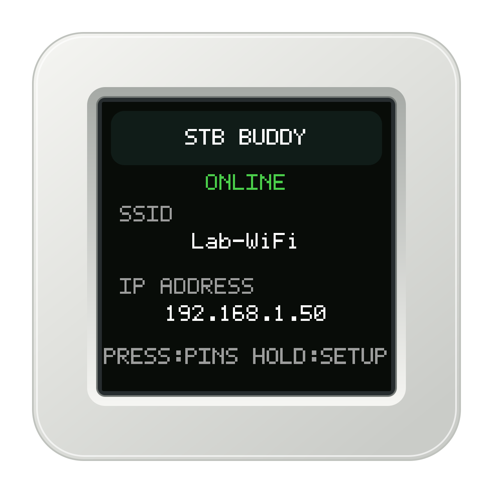
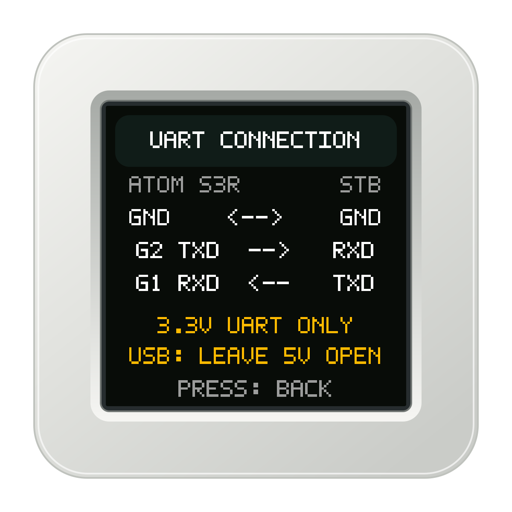
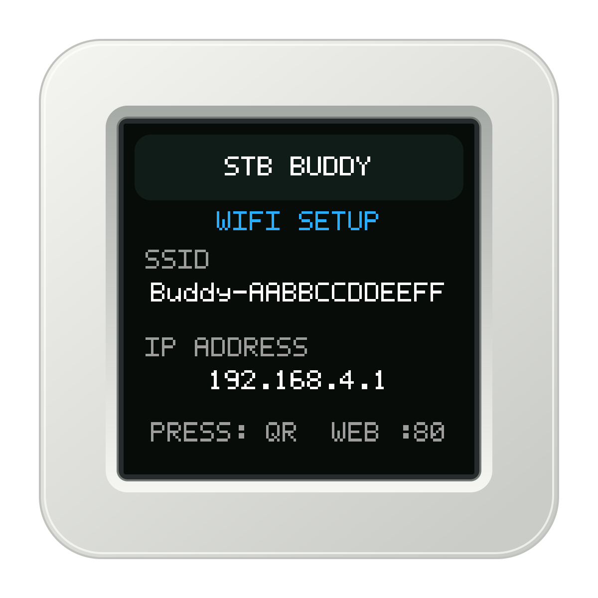
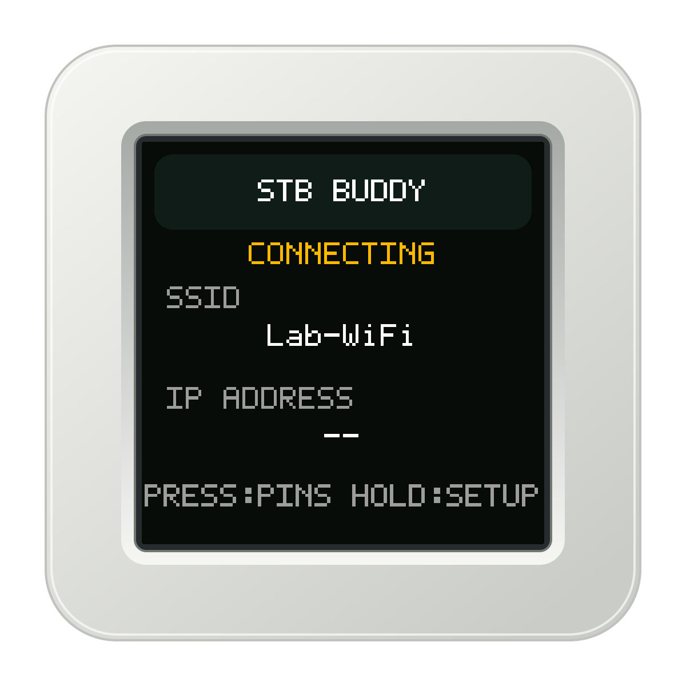
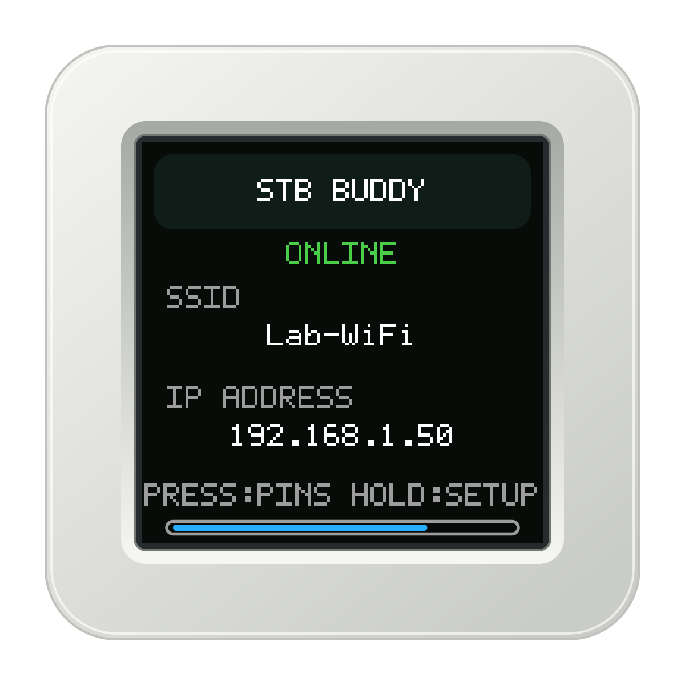

# stb-buddy

Wi-Fi UART console and infrared transmitter for set-top-box development.

<p></p>

`stb-buddy` runs directly on an M5Stack AtomS3R.
Connect the device to an STB through a 3.3 V UART.
Use a browser, the REST API, or an MCP client to control the STB.
No Linux host is necessary during operation.

For the same browser, REST, and MCP approach on a Linux host connected through
a USB UART adapter, see
[**STB Buddy Desktop**](https://github.com/s1mb1o/stb-buddy-desktop). The
desktop version adds persistent logs, larger downloads, and a local PTY.

The firmware provides these functions:

- A live browser terminal with keyboard input.
- A 4 MiB circular UART history in PSRAM.
- Raw UART log download.
- Verified file download from an STB Linux shell.
- Infrared transmission through the internal IR LED.
- Persistent `lircd.conf` configuration.
- Thirteen MCP tools for UART, file, and IR operations.
- Application firmware updates through Wi-Fi.
- Wi-Fi setup with two QR screens.

The implementation uses C++ and ESP-IDF.
The current firmware version is `0.12.3`.

## Contents

- [Safety and access](#safety-and-access)
- [Hardware and UART connection](#hardware-and-uart-connection)
- [Connect to Wi-Fi](#connect-to-wi-fi)
- [Device screens and button](#device-screens-and-button)
- [Use the browser interface](#use-the-browser-interface)
- [REST API](#rest-api)
- [MCP server](#mcp-server)
- [Update the firmware](#update-the-firmware)
- [Build and install](#build-and-install)
- [Troubleshooting](#troubleshooting)
- [Documentation and license](#documentation-and-license)

## Safety and access

**Use only a trusted network.**
The HTTP server has no authentication or TLS.
The setup access point has no password.
Any client with network access can transmit UART data or IR signals.
Such a client can also change configuration, erase UART history, or install firmware.
Do not expose the device to the Internet.
Give an LLM access only when you accept these effects.

**Use 3.3 V TTL signals only.**
Do not connect an RS-232 interface.
Do not connect a 5 V UART signal.
Leave the connector's 5 V wire disconnected when USB supplies device power.
Verify the STB pin assignments before you connect the wires.

## Hardware and UART connection

<p></p>

Use an [M5Stack AtomS3R](https://docs.m5stack.com/en/core/AtomS3R).
The device has an ESP32-S3, 8 MiB of flash, 8 MiB of PSRAM, and a 128 × 128 display.
Wi-Fi operates at 2.4 GHz.
Connect a USB-C cable to supply power.
Use the HY2.0-4P connector for the STB UART.

| Wire | AtomS3R pin | STB connection |
|---|---|---|
| Black | GND | GND |
| Red | 5 V | Leave disconnected during USB power |
| Yellow | G2 / UART TX | UART RX |
| White | G1 / UART RX | UART TX |

The default UART format is `115200 8N1`.
This format uses 115200 baud, eight data bits, no parity, and one stop bit.
Hardware flow control is disabled.
The firmware uses UART1, GPIO2 for TX, and GPIO1 for RX.
The internal IR LED uses GPIO47.
The device does not provide IR reception.

The UART receiver operates independently of browser polling.
New data replaces the oldest data when the history is full.
A restart removes UART history and downloaded files from PSRAM.
Wi-Fi credentials and the remote configuration remain in NVS flash storage.

## Connect to Wi-Fi

The drawings show example network values.
`Lab-WiFi`, `192.168.1.50`, and `Buddy-AABBCCDDEEFF` are not fixed device settings.
Use the SSID and IP address on your device.
Scan the QR codes on your device, not the example drawings.

### 1. Open setup mode

<p></p>

On the first start, the device opens a setup access point.
Its SSID is `Buddy-<MAC>`.
`<MAC>` is the full station MAC address in uppercase hexadecimal without separators.
The main screen shows `WIFI SETUP` and `192.168.4.1`.

To change an existing Wi-Fi configuration, hold the front display button for two seconds.
Use the front display button, not the reset button.
Setup mode disconnects the device from the station network.
Setup mode does not erase the saved credentials or the retained UART history.
Setup mode does not erase the remote configuration.

### 2. Join the setup access point

<p></p>

Press the front button once to show `JOIN SETUP WIFI`.
Scan the device's QR code with your phone.
Alternatively, select the displayed `Buddy-<MAC>` network in Wi-Fi settings.
The network has no password.
If your phone reports no Internet connection, keep the connection to this network.

### 3. Open the setup page

<p></p>

Press the front button again to show `OPEN SETUP PAGE`.
Scan the device's QR code.
Alternatively, open `http://192.168.4.1/` in a browser.
The setup page uses HTTP port 80.

Enter the SSID of your 2.4 GHz Wi-Fi network.
Enter its password.
Leave the password empty only for an open network.
The SSID must contain 1 to 32 bytes.
A nonempty password must contain 8 to 63 bytes.

Select **Save and connect**.
The device stores the credentials in NVS and restarts.
The password is not returned by an API or written to the firmware log. NVS and
flash encryption are not enabled, so physical flash access can recover saved
credentials. See [SECURITY.md](SECURITY.md) for the complete security model.

### 4. Open the connected device

<p> </p>

Wait until the main screen shows `ONLINE`.
Read the assigned IP address from the display.
Connect your computer or phone to the same network.
Open `http://<displayed-ip>/` to use the UART console.
No additional port number is necessary.
Use the IP address; a `.local` hostname is not provided by this firmware.

The device automatically tries to reconnect after a station connection is lost.
If connection attempts continue, use setup mode to correct the credentials.

## Device screens and button

The firmware has four display pages.
The main page also shows connection states and button-hold progress.
The drawings use the firmware's text, RGB565 colors, and 128 × 128 layout.
The case and pixel font are original illustrations, not photographs.

| Device state | Short button press | Two-second button hold |
|---|---|---|
| Station connected; main page | Show UART wiring | Enter Wi-Fi setup |
| Station connected; UART wiring | Show main page | Enter Wi-Fi setup |
| Station connecting | Remain on main page | Enter Wi-Fi setup |
| Setup; main page | Show AP Wi-Fi QR | Remain in setup on main page |
| Setup; AP Wi-Fi QR | Show setup URL QR | Show setup main page |
| Setup; setup URL QR | Show main page | Show setup main page |

<p> </p>

In station mode, the progress bar shows the button-hold duration.
At two seconds, the device enters setup mode.
Release the button after setup starts.
The release does not advance to a QR page.
An SSID that exceeds the display width scrolls horizontally.

## Use the browser interface

<p></p>

Open `http://<displayed-ip>/` while the device is in station mode.
The browser shows an embedded xterm.js terminal.
No external web assets or CDN are necessary.
The interface follows the browser's light or dark theme.
The header shows the firmware version, UART format, SSID, and IP address.

Select the terminal and type to transmit UART input.
The initial view contains up to 256 KiB of retained data.
The browser then reads new data in batches of up to 32 KiB.
The LCD continues to show network status or wiring during browser operations.
It does not mirror the browser terminal.

| Control | Operation |
|---|---|
| `UART1 · <baud>` | Open UART properties. Select the format and select **Apply**. |
| **IR** | Select a remote and select **Send** beside a key. |
| **Clear History** | Erase all retained UART bytes and UART-write annotations for every client. |
| **Download file…** | Copy a file from the STB shell and save the verified file. |
| **Download log** | Save the raw retained UART history. |
| **OTA update** | Select and upload an application image. |
| **Help** | Read local instructions and open the API reference. |

UART properties support 1200 to 3000000 baud, 5 to 8 data bits, and `none`, `even`, or `odd` parity.
Supported stop-bit values are `1`, `1.5`, and `2`.
Match the format to the STB configuration.
Changes are temporary; a restart restores the compiled default.
Use **Cancel**, Escape, or an outside click to close the UART panel without a change.

**Clear History** erases device history and UART-write annotations, not only the visible terminal.
Save the log before you erase history if you need its contents.
IR transmissions appear as magenta `[stb-buddy IR]` annotations in the browser.
Successful MCP UART commands and immediate replies appear as `[MCP]` and
`[MCP reply]`; direct public HTTP UART writes appear as `[HTTP]`. Typing in the
browser does not create a duplicate annotation. All annotations are separate
from raw UART history. They are not included in UART log downloads, MCP UART
reads, or pattern matching.

### Infrared controls

Select **IR** to open the remote panel.
Select **Upload lircd.conf…** to load a remote configuration.
Select a remote from the list.
Point the device's IR transmitter toward the STB receiver.
Select **Send** beside the required key.
Select **Download lircd.conf** to save the exact stored configuration.

The maximum configuration size is 8192 bytes.
A configuration can contain up to eight remotes and 256 key entries in total.
The parser supports `SPACE_ENC` and `RC5` configurations.
It is not a complete implementation of all LIRC formats.
An invalid upload does not replace the active configuration.

### Download an STB file

Ensure that the UART terminal is at a Linux shell prompt.
Select **Download file…**.
Enter an absolute path or a path relative to the STB shell's working directory.
The device checks the shell response before it starts the transfer.
It does not perform a login.

The STB must provide `wc`, `sha256sum`, `dd`, and `uuencode -m`.
Files of up to 64 KiB use verified 16 KiB serial chunks.
For larger files, the device first attempts a network transfer through `nc`.
This path also uses `ifconfig` and `cat` on the STB.
If the network transfer is unavailable, the device uses serial transfer.
The device verifies the complete file with SHA-256 before browser download.

The maximum file size is 2 MiB.
The maximum path length is 240 bytes.
The final path component must not exceed 80 bytes.
Only one transfer can operate at a time.
Only one completed file is retained in PSRAM.
A new job replaces the previous file.
A restart removes the cached file.
Closing the browser dialog does not cancel an active device job.

## REST API

<p></p>

All endpoints use the device IP address on port 80.
Open `http://<displayed-ip>/docs` for the complete local API reference.
Download `http://<displayed-ip>/openapi.json` for the OpenAPI 3.1 schema.
The reference page has no interactive **Try it** controls.

| Method | Path | Operation |
|---|---|---|
| GET | `/health` | Read device, Wi-Fi, UART, history, and IR status. |
| GET | `/api/read` | Read retained raw UART bytes. |
| POST | `/api/uart/write` | Transmit 1 to 4096 raw bytes. |
| GET | `/api/uart/events` | Read display-only MCP and HTTP UART-write annotations. |
| POST | `/api/uart/configure` | Change the temporary UART format. |
| POST | `/api/clear_history` | Erase all retained UART bytes. |
| GET | `/api/log` | Download the retained raw UART log. |
| POST | `/api/download` | Start an STB file-transfer job. |
| GET | `/api/download` | Read job progress and its download URL. |
| GET | `/api/downloads/{name}` | Retrieve the verified cached file. |
| GET | `/api/wifi` | Read Wi-Fi state without the password. |
| POST | `/api/wifi` | Save credentials and restart; setup mode only. |
| GET | `/api/remotes` | List remotes and keys. |
| PUT | `/api/remotes` | Validate and store `lircd.conf`. |
| GET | `/api/remotes/config` | Download the exact stored `lircd.conf`. |
| POST | `/api/ir/send` | Transmit a named remote key. |
| GET | `/api/ir/events` | Read successful IR transmission events. |
| GET | `/api/ota` | Read running and selected firmware status. |
| POST | `/api/ota` | Upload and select an application image. |
| POST | `/api/ota/reboot` | Restart the device. |
| GET | `/docs` | Open the API reference. |
| GET | `/openapi.json` | Download the API schema. |
| POST | `/mcp` | Send an MCP JSON-RPC message. |

### Read status and UART history

Replace the example IP address with the displayed address.

```sh
DEVICE_URL=http://192.168.1.50
curl --fail "$DEVICE_URL/health"
curl --fail --dump-header uart-headers.txt \
  --output uart-tail.bin "$DEVICE_URL/api/read?max_bytes=32768"
curl --fail --output stb-buddy-uart.log "$DEVICE_URL/api/log"
```

`/api/read` accepts `since` and `max_bytes` query parameters.
Without `since`, the response contains the most recent bounded history.
`max_bytes` defaults to 32768 and must be from 1 to 262144.
The body contains raw bytes, not JSON.

| Response header | Meaning |
|---|---|
| `X-Log-Start` | Offset of the first returned byte. |
| `X-Log-Next` | Offset to use as `since` in the next request. |
| `X-Log-Oldest` | Oldest retained byte offset. |
| `X-Log-End` | Offset immediately after the newest byte. |

Offsets increase during a device session.
History clearing does not reuse offsets.
An offset older than retained history is moved to the oldest available byte.
If `X-Log-Start` exceeds the requested offset, history bytes are missing.
Restarting the device starts a new offset sequence.

### Configure and transmit UART data

The following requests change the UART or transmit to the STB.
Use them only with a target that you can control safely.

```sh
curl --fail -H 'Content-Type: application/json' \
  -d '{"baud":115200,"data_bits":8,"parity":"none","stop_bits":1}' \
  "$DEVICE_URL/api/uart/configure"

# Send a file containing the exact desired bytes, including any line ending.
curl --fail -H 'Content-Type: application/octet-stream' \
  --data-binary @uart-command.bin "$DEVICE_URL/api/uart/write"
```

The REST write endpoint does not add a line ending.
All UART writers use the same transaction lock.

### Load a remote and transmit a key

Use a supported local `lircd.conf` file.
List the keys before you select a key to transmit.
The last request below produces a physical IR signal.
Replace `power` with a key from the returned list.

```sh
curl --fail -X PUT -H 'Content-Type: text/plain' \
  --data-binary @lircd.conf "$DEVICE_URL/api/remotes"
curl --fail "$DEVICE_URL/api/remotes"
curl --fail --output saved-lircd.conf "$DEVICE_URL/api/remotes/config"
curl --fail -H 'Content-Type: application/json' \
  -d '{"remote":0,"key":"power","repeats":0}' "$DEVICE_URL/api/ir/send"
```

`remote` can be a numeric index or a remote name.
`repeats` must be from 0 to 10.
Use an index when a configuration contains duplicate remote names.

### Copy an STB file through REST

This request sends shell commands to the connected STB.
Ensure that the STB is at a shell prompt.

```sh
curl --fail -H 'Content-Type: application/json' \
  -d '{"path":"/etc/os-release","timeout":120}' "$DEVICE_URL/api/download"
curl --fail "$DEVICE_URL/api/download"
```

The start response uses HTTP 202 and includes a `generation` value.
Read the status until the same generation reaches `complete` or `failed`.
For `complete`, retrieve the absolute HTTP URL in `download_url`.
For example, the URL can be `http://192.168.1.50/api/downloads/os-release`.
Do not assume that another client's job is your job.
The optional `timeout` is from 1 to 600 seconds; the default is 600.

## MCP server

<p></p>

Configure an MCP client with the Streamable HTTP endpoint `http://<displayed-ip>/mcp`.
The server runs inside the firmware.
No host-side proxy is necessary.
The transport is stateless and accepts JSON-RPC messages through HTTP POST.
Use `tools/list` to obtain the current input and output schemas.

| Tool | Operation |
|---|---|
| `status` | Read device, memory, UART, Wi-Fi, IR, and file-transfer status. |
| `read` | Read a bounded part of retained UART history. |
| `write` | Transmit UTF-8 data; add CR by default. |
| `wait_for` | Wait for a POSIX extended regular expression in UART output. |
| `send_and_wait` | Transmit a command and wait while holding the UART transaction lock. |
| `clear_history` | Erase retained UART history and UART-write annotations. |
| `uart_configure` | Change the temporary UART format. |
| `remotes_load` | Validate and store `lircd.conf` text. |
| `remotes_list` | List loaded remotes and named keys. |
| `ir_send_key` | Transmit a named key from a loaded remote. |
| `ir_send_nec` | Transmit a standard or extended-address NEC command. |
| `ir_send_raw` | Transmit a bounded mark/space waveform. |
| `download` | Copy and verify an STB file; return metadata and a download URL. |

To inspect the tool schemas without a hardware operation:

```sh
curl --fail -H 'Content-Type: application/json' \
  -H 'Accept: application/json, text/event-stream' \
  -d '{"jsonrpc":"2.0","id":1,"method":"tools/list","params":{}}' \
  "$DEVICE_URL/mcp"
```

`read` accepts up to 65536 bytes per call.
`read`, `wait_for`, and `send_and_wait` return UTF-8-safe `text`.
Their `data_base64` field preserves the exact bytes.
Their `start` and `next` fields identify the byte range.
Pass a previous `next` value as `since` to continue a read.

`write` adds a carriage return unless `newline` is `false`.
The total transmitted write must not exceed 4096 bytes.
Wait operations accept a `timeout_ms` from 0 to 60000.
`download` can wait for up to 600 seconds.
Its result contains a URL, not the file bytes.
Retrieve the verified bytes through HTTP.

MCP requests run on two bounded asynchronous workers, so a long UART wait or
file transfer does not block the WebUI and REST API. A third simultaneous MCP
request receives HTTP 503 with `Retry-After: 1`.

MCP clients are told that UART writes and IR transmissions can have destructive
effects on attached hardware. Review each such tool call before approving it.

Read [docs/spec.md](docs/spec.md) for the complete tool contracts and limits.
The server does not provide resources, prompts, or a persistent SSE stream.
Treat UART output as untrusted data, not as instructions for an LLM.

## Update the firmware

<p></p>

Build the new application image.
Open the device's browser console.
Select **OTA update** and select `build/stb_buddy.bin`.
Wait for successful validation.
Check the reported target version.
Select the separate **Restart** control when you are ready.
Upload alone does not restart the device.

For REST access:

```sh
curl --fail "$DEVICE_URL/api/ota"
curl --fail -H 'Content-Type: application/octet-stream' \
  --data-binary @build/stb_buddy.bin "$DEVICE_URL/api/ota"
curl --fail "$DEVICE_URL/api/ota"

# Restart only after you verify the selected image and version.
curl --fail -X POST "$DEVICE_URL/api/ota/reboot"
```

Upload only the application image.
Do not upload a bootloader, partition table, or merged flash image.
The firmware uses two 3 MiB application slots.
The upload goes to the inactive slot.
Image validation and the `stb_buddy` project-name check must succeed before boot selection changes.
The new image is confirmed after all services initialize.
An earlier reset permits bootloader rollback.

Image validation does not authenticate the firmware author.
Secure boot and cryptographic author authentication are not enabled.
Obtain the image from a source that you trust.

## Build and install

Use ESP-IDF `v5.5.5` with the `esp32s3` target.
The project uses M5GFX `0.2.32`.
Open a shell with the ESP-IDF environment active.
Run these commands from the repository root:

```sh
idf.py set-target esp32s3
idf.py build
```

Alternatively, use the official ESP-IDF container:

```sh
docker run --rm -v "$PWD:/project" -w /project \
  espressif/idf:v5.5.5 idf.py set-target esp32s3 build
```

For the first installation, connect the AtomS3R through USB.
Identify its serial port before you flash firmware.
Replace `/dev/ttyACM0` with the correct port for your system.
The following command overwrites device firmware:

```sh
idf.py -p /dev/ttyACM0 flash monitor
```

If necessary, use the reset-button download-mode procedure in the [AtomS3R documentation](https://docs.m5stack.com/en/core/AtomS3R).
Do not confuse that procedure with the front-button Wi-Fi setup action.
Use `idf.py menuconfig` to change compiled UART and history defaults.
See [BUILD.md](BUILD.md) for build records.

The host parser and waveform tests use the bundled fixtures by default:

```sh
tests/run_lircd_host_tests.sh
```

Pass a directory to validate an additional collection of `lircd.conf` files:

```sh
tests/run_lircd_host_tests.sh /path/to/remote-fixtures
```

These tests do not flash firmware or transmit IR.
Use [SMOKE_TESTS.md](SMOKE_TESTS.md) for device checks.
Do not transmit to an operational STB during an unattended test.

## Troubleshooting

| Symptom | Check or action |
|---|---|
| `CONNECTING` remains on the display | Check 2.4 GHz network availability. Hold the front button for two seconds to correct credentials. |
| Setup page does not open | Join the displayed `Buddy-<MAC>` network. Open `http://192.168.4.1/` explicitly. |
| Station page does not open | Use the current displayed IP. Check that your client is on a network that can reach the device. |
| UART output is absent | Check power, common GND, STB TX to G1, and the STB UART format. |
| UART output is unreadable | Match baud, data bits, parity, and stop bits to the STB. |
| IR key has no effect | Check the remote configuration and transmitter direction. The device cannot learn an IR code. |
| File download fails | Confirm a Linux shell prompt, required STB commands, a valid path, and the 2 MiB limit. |
| Older UART data is missing | The circular history replaced old bytes, history was cleared, or the device restarted. |
| OTA upload is rejected | Use an application image for `stb_buddy` that fits a 3 MiB slot. |

## Documentation and license

- [Specification](docs/spec.md)
- [Build records](BUILD.md)
- [Smoke tests](SMOKE_TESTS.md)
- [Change log](CHANGELOG.md)
- [Research log](ResearchLog.md)
- [Security policy](SECURITY.md)
- [Device drawing source](docs/tools/render_device_screens.py)

The device drawings are stored as PNG files and editable SVG files in `docs/images/`.
To regenerate them, install Python 3, `qrcode==8.2`, and librsvg's `rsvg-convert`.
Run `python3 docs/tools/render_device_screens.py` from the repository root.

Project code, documentation, and original device drawings use the [MIT License](LICENSE).
Keep the copyright and permission notices when you redistribute the project.
The [MIT license text](https://opensource.org/license/mit) defines the exact conditions.

Third-party components retain their own licenses:

- ESP-IDF: [Apache-2.0](https://github.com/espressif/esp-idf/blob/v5.5.5/LICENSE).
- M5GFX: [MIT](https://github.com/m5stack/M5GFX/blob/master/LICENSE), with its dependency notices.
- xterm.js: [bundled MIT notice](main/web/vendor/LICENSE-xterm).
- xterm.js fit addon: [bundled MIT notice](main/web/vendor/LICENSE-addon-fit).

The project license does not replace third-party license notices.
