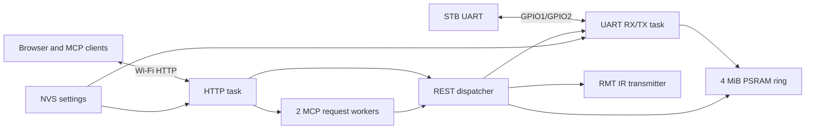

# stb-buddy specification

Date: 2026-10-08

Status: firmware 0.12.3 shows UART writes initiated through MCP or the public
HTTP API as magenta browser annotations without adding them to raw UART
history. It includes the ordered console toolbar, embedded help and OpenAPI
documentation, browser IR panel, UART properties, verified file download,
complete MCP, UART capture, Wi-Fi, named-key IR and OTA feature set.

## Purpose

`stb-buddy` is an M5Stack AtomS3R firmware that works without a Linux host. It
owns one physical STB UART, retains recent output, exposes console operations
to MCP clients over Wi-Fi, and transmits IR commands.

## Hardware profile

- Board: M5Stack AtomS3R, ESP32-S3-PICO-1-N8R8.
- Flash: 8 MiB; PSRAM: 8 MiB.
- UART: UART1, 115200 8N1 by default, no flow control.
- UART RX: GPIO1, white HY2.0 wire, connected to STB TX.
- UART TX: GPIO2, yellow HY2.0 wire, connected to STB RX.
- Common ground: black HY2.0 wire.
- IR TX: onboard IR LED driver on GPIO47, driven by RMT.
- Display: onboard 128 x 128 color LCD, driven through M5GFX. AtomS3R panel
  variants supported by M5GFX are accepted.
- Button: onboard active-low button on GPIO41.

## Runtime architecture



## UART history

- Store raw bytes, not parsed lines.
- Default capacity: 4,194,304 bytes in PSRAM.
- Positions are monotonically increasing 64-bit byte offsets.
- Reads are non-destructive and clamp an old offset to the oldest retained
  byte.
- When full, new bytes overwrite the oldest bytes.
- `clear_history` discards all retained bytes but does not reuse offsets.
- Never persist continuous UART traffic to internal flash.

At maximum continuous 115200 8N1 traffic, the default history covers about
six minutes. At 80 bytes per text line it retains about 52,000 lines.

## Network and provisioning

- Normal operation uses Wi-Fi station credentials stored in NVS. The password
  is never returned by an API or written to a log.
- When credentials are absent, or after the onboard button is held for two
  seconds, the device enters setup mode without deleting the saved credentials.
- Setup mode starts an open SoftAP named `Buddy-<MAC>`, where `<MAC>` is the
  full uppercase station MAC without separators. Its address is `192.168.4.1`.
- Opening `http://192.168.4.1/` on HTTP port 80 in setup mode shows a form for
  the target SSID and password. The password can be empty for an open network,
  otherwise it must contain 8 through 63 bytes.
- A valid submission is committed to NVS before the response is returned. The
  device then restarts and connects in station mode. Invalid or incomplete
  requests do not replace the stored credentials.
- Station disconnects trigger reconnection attempts. Holding the button again
  remains the recovery path when credentials are wrong or the network is gone.
- One HTTP server on port 80 serves the setup form, browser console, REST API,
  OTA and MCP endpoint in both setup and station modes. Port 8765 is not used.
- The server permits eight open client sockets and purges the least recently
  used idle session when necessary, so a browser's parallel connections cannot
  starve the API while remaining within the system's 16-socket bound.
- Health endpoint: `GET /health` on port 80.
- MCP endpoint: `/mcp` on port 80 using Streamable HTTP.
- Human-readable REST API documentation: `GET /docs`.
- OpenAPI 3.1 schema: `GET /openapi.json`.
- No mDNS name is advertised; clients use the IPv4 address on the display.

The setup AP intentionally has no password. Setup and the normal HTTP API are
appropriate only while physical access and the network are trusted. A later
release must add authentication before untrusted-LAN deployment.

## On-device display and button

The display continuously presents the active Wi-Fi SSID and IPv4 address.
SSID text wider than the available row scrolls horizontally as a repeating
marquee; shorter SSIDs remain centered. The screen distinguishes setup,
connecting and online states. In setup mode it shows the `Buddy-<MAC>` SSID,
`192.168.4.1`, and HTTP port 80.

The bottom of the normal screen identifies the two-second button hold used to
enter Wi-Fi setup. While the button is held, a progress bar provides feedback.
Entering setup mode changes only network operation; it does not clear UART
history, remote configuration, or the previously stored credentials.

In setup mode, a short button press cycles the display through three screens:

1. The main setup status screen.
2. A Wi-Fi QR code with the standard payload
   `WIFI:T:nopass;S:Buddy-<MAC>;;` for joining the open setup AP.
3. A URL QR code for `http://192.168.4.1/`.

The next short press returns to the main screen. A long press does not also
trigger a short-press action when the button is released.

In station mode, when Wi-Fi is connected, a short button press switches from
the main status screen to the UART wiring screen. This screen shows these
connections:

- AtomS3R `GND` to STB `GND`.
- AtomS3R `TXD` on GPIO2 to STB `RXD`.
- AtomS3R `RXD` on GPIO1 to STB `TXD`.

The screen also states that the UART voltage is 3.3 V. It tells the user to
leave the 5 V pin disconnected when the AtomS3R is USB-powered. The next short
press returns to the main screen. The wiring screen is not available while
Wi-Fi is connecting. QR screens are not shown in station mode because the
setup AP is not active.

## Browser console

In station mode `GET /` serves an embedded, dependency-free-from-the-network
web console patterned after `tools/serial-hub`: a compact status bar, an
xterm.js terminal, system light/dark theme tracking, UART keyboard input,
Clear History, Download File, Download Log and OTA Update. The status bar
shows the running firmware version. All assets, including xterm.js, are served
by the device rather than a CDN.

After the connection and device status, toolbar actions appear in this order:
**IR**, **Clear History**, **Download file…**, **Download log**, **OTA update**
and **Help**. The conditional **Restart** action appears beside **OTA update**
after a validated image upload.

The `UART<port> · <baud>` status item is a button. Selecting it opens a
compact anchored UART-properties panel with baud rate, data bits, parity and
stop bits. **Apply** changes the live port atomically and updates the status
item; **Cancel**, Escape or a click outside closes the panel. The panel is not
modal and does not clear retained history. Settings last until reboot, which
restores the compiled defaults.

The **IR** toolbar button opens a wider anchored popover, using the same
non-modal interaction as the UART-properties panel. It fetches the loaded
remote blocks, lets the user select one remote, and shows every key name in
that block with its own **Send** button. A successful send leaves the panel
open, records the normal magenta IR annotation, and briefly marks that key as
sent. The popover also downloads the exact persisted `lircd.conf` and accepts
a local `lircd.conf` upload. A successful upload is parsed and persisted
atomically through the existing remote API, then refreshes the remote and key
list. Escape or a click outside closes the popover; interacting with its
scrollable contents does not.

The **Help** toolbar button opens a non-modal anchored popover with concise
instructions for UART wiring and console use, runtime port settings, STB file
download, IR, OTA, Wi-Fi recovery and the trusted-network requirement. It
links to the embedded human-readable REST API reference and to the raw OpenAPI
schema. The popup uses the same Escape and outside-click behavior as the UART
and IR panels; opening any one of the three closes the others.

- `GET /api/read?since=<offset>&max_bytes=<n>` returns retained raw UART bytes
  and absolute offset headers. `max_bytes` is bounded to 256 KiB. Omitting
  `since` replays at most the requested tail; the page requests 256 KiB on its
  first read and 32 KiB thereafter.
- `POST /api/uart/write` accepts 1 through 4096 raw bytes and sends them to the
  STB UART. A successful public API write creates an `[HTTP]` annotation.
  Browser keyboard input is serialized into bounded requests and is marked as
  interactive so it does not create a duplicate annotation.
- `GET /api/uart/events?since=<sequence>` returns annotations for successful
  UART writes initiated through the public HTTP API or MCP. The device retains
  the latest 32 annotations in RAM. Each record contains a source (`HTTP`,
  `MCP`, or `MCP reply`) and a display-safe representation bounded to 255
  characters; ASCII control bytes use caret notation and other non-ASCII bytes
  use hexadecimal escapes. The browser renders the records in bold magenta and
  reports if records were overwritten while it was away.
- `POST /api/uart/configure` accepts `baud` from 1200 through 3000000,
  `data_bits` from 5 through 8, `parity` as `none`, `even` or `odd`, and
  `stop_bits` as 1, 1.5 or 2. It returns the applied live configuration.
- `POST /api/clear_history` discards every retained UART byte without reusing
  offsets and clears the UART-write annotation ring. Every polling browser
  detects the advanced oldest offset and clears its terminal and scrollback.
- `GET /api/log` downloads the retained UART history as
  `stb-buddy-uart.log`. Under continuous traffic, bytes overwritten before the
  download reaches them cannot be recovered.
- **OTA Update** opens a local `.bin` file picker, uploads the selected image
  to `POST /api/ota`, and reports upload progress and the validated version.
  Uploading never restarts the device automatically; after a successful upload
  the browser presents a separate **Restart** action using
  `POST /api/ota/reboot`.
- `GET /api/ir/events?since=<sequence>` returns successful IR transmissions
  newer than the supplied event sequence. The device retains the latest 32
  events in RAM. The browser renders each event as a bold magenta annotation
  in the terminal and reports if events were overwritten while it was away.
- `GET /api/remotes/config` downloads the exact persisted remote configuration
  as `lircd.conf`; it returns 404 when no configuration has been stored.
- `GET /api/wifi` returns mode, connection state, SSID and IPv4 address but
  never the password. `POST /api/wifi` accepts new credentials only while the
  device is in setup mode.

UART reception remains independent of browsers. A slow, disconnected, or
polling client cannot block the UART reader; unread data is handled only by the
fixed-size PSRAM ring's normal overwrite policy.

IR and UART-write annotations are separate presentation channels: they are not
inserted into the UART ring, do not change UART offsets, cannot satisfy
`wait_for`, and do not appear in UART downloads or MCP `read` results. An IR
event is recorded only after the complete requested transmission succeeds,
whether initiated through the HTTP API or any MCP IR tool. MCP `write` and
`send_and_wait` actions create an `[MCP]` annotation after their UART write
succeeds; an immediate `wait_for`/`send_and_wait` reply creates an
`[MCP reply]` annotation. Browser keyboard writes do not create annotations.

## Embedded API documentation

`GET /openapi.json` serves a self-contained OpenAPI 3.1 document for every
public REST endpoint plus the generic Streamable HTTP MCP transport. It records
request content types, parameter bounds, response schemas, binary downloads
and side effects such as clearing history, changing Wi-Fi, transmitting IR,
installing firmware and restarting the controller. The document declares that
the API has no authentication.

`GET /docs` serves a dependency-free human-readable renderer for that schema.
It groups operations by tag and shows method, path, summary, description,
parameters, request content types and response codes. The renderer fetches the
schema from the same device and has no CDN dependency. It is intentionally
read-only: it does not provide a “try it” control for destructive operations.

## Download files from the STB

**Download file…** copies one readable file from the STB shell to the browser,
following the `tools/serial-hub` workflow. It does not install software or
modify the source file. The STB must already be at a Linux shell prompt.

1. Send `echo READY_$((40+2))` and require an exact `READY_42` line within five
   seconds. On failure, stop without sending recovery commands.
2. Read source size and SHA-256 with BusyBox `wc -c` and `sha256sum`.
3. For files through 64 KiB, use verified 16 KiB serial chunks. For larger
   files, first show addresses from `ifconfig` and try `cat | nc` to an
   ephemeral listener on stb-buddy; fall back to serial if no connection
   arrives within five seconds.
4. For each serial chunk, run `dd | sha256sum` and `dd | uuencode -m`, ignore
   non-base64 console lines, and retry a damaged chunk up to three times.
5. Compare the final byte count and SHA-256 with the source before making the
   file available to the browser.

The transfer runs in a background task, while UART RX and the port-80 server
remain responsive. Commands and base64 output remain ordinary UART history.
One transfer may run at a time. One completed file of at most 2 MiB is cached
in PSRAM until another transfer starts or the device reboots; downloaded data
is never written to internal flash. Starting another transfer discards the
previous cached file. A failed transfer retains no partial file.

- `POST /api/download` accepts `{ "path": "...", "timeout": 600 }`, starts
  the job, and returns HTTP 202 with its generation number. Paths are limited
  to 240 bytes, the final path component to 80 bytes, and the timeout to 1
  through 600 seconds. Characters outside ASCII letters, digits, `.`, `_` and
  `-` in the browser-facing filename are replaced with `_`; the quoted source
  path itself is not changed.
- `GET /api/download` returns state, elapsed time, byte progress and, when
  complete, name, size, transport, retries, board addresses, source/copy
  hashes and `download_url`.
- `GET /api/downloads/<name>` streams the verified cached bytes with an
  attachment filename. It never returns an active, failed or previous job.

The WebUI dialog matches serial-hub: path field, busy timer, result metadata,
automatic browser save, **Close** after success, and errors that retain the
path for retry. Esc and Cancel cannot stop an active transfer.

The `download` MCP tool performs the same job synchronously in an asynchronous
HTTP request worker and returns the metadata and HTTP URL. Its call can take up
to 600 seconds without blocking the WebUI or REST server; the actual bytes are
fetched from `download_url`, not embedded in the MCP response.

## OTA application updates

The 8 MiB flash layout contains two 3 MiB application slots. OTA updates write
the raw ESP-IDF application image (`build/stb_buddy.bin`) to the inactive slot;
they do not accept a merged flash image, bootloader image, or partition table.

- `GET /api/ota` reports the running and selected boot partitions, their
  application versions, the running image state, and whether a reboot is
  pending.
- `GET /health` includes the running firmware `version` used by the browser
  status bar.
- `POST /api/ota` accepts the application binary as
  `application/octet-stream`. It streams the body directly into the inactive
  OTA partition, validates the ESP image and the `stb_buddy` project name, and
  selects that partition only after all validation succeeds.
- `POST /api/ota/reboot` returns a response and then restarts the controller.

An interrupted, oversized, or invalid upload leaves the selected boot
partition unchanged. A newly booted image remains pending until UART, IR,
Wi-Fi, remote storage, and HTTP initialization have all succeeded; only then
does the firmware mark the image valid. If it resets before confirmation, the
ESP-IDF bootloader rolls back to the previous image.

Example:

```sh
curl http://192.168.4.1/api/ota
curl -H 'Content-Type: application/octet-stream' \
  --data-binary @build/stb_buddy.bin \
  http://192.168.4.1/api/ota
curl -X POST http://192.168.4.1/api/ota/reboot
```

OTA is unauthenticated while the setup AP is open. It is suitable only for a
physically controlled device or trusted network until access control is added.
ESP image validation detects corruption but does not authenticate the firmware
author; secure boot and signed-update policy are outside the initial release.

## MCP compatibility

The embedded server implements only the server methods it needs rather than
embedding a general-purpose MCP SDK. `POST /mcp` is a stateless Streamable
HTTP endpoint on port 80. Responses are direct `application/json` JSON-RPC
messages; SSE, sessions, server notifications, resources, prompts, sampling
and tasks are out of scope.

- Handshake-era MCP accepts `initialize`, `notifications/initialized`, `ping`,
  `tools/list` and `tools/call`. It echoes the client's handshake-era revision,
  including 2025-11-25, 2025-06-18, 2025-03-26 and 2024-11-05.
- MCP 2026-07-28 accepts `server/discover`, `ping`, `tools/list` and
  `tools/call`. `server/discover` advertises both 2026-07-28 and 2025-11-25.
- Notifications without an `id` receive HTTP 202 with an empty body. Other
  calls receive one JSON-RPC response. Batch requests are not supported.
- The server validates the `MCP-Protocol-Version` header and the matching
  `params._meta["io.modelcontextprotocol/protocolVersion"]` value when either
  is supplied for 2026-07-28 requests.
- Tool successes include both a text content item and `structuredContent`.
  Expected tool failures use `isError: true`; malformed JSON-RPC calls use the
  standard protocol error codes.
- Tool descriptions include input and output schemas plus accurate read-only,
  destructive, idempotent and open-world annotations.

The endpoint accepts request bodies up to 24 KiB. Tool result history text is
bounded to 64 KiB per call, and UART pattern waits are bounded to 60 seconds.
Two bounded asynchronous MCP workers keep the main HTTP server responsive. A
third simultaneous MCP request receives HTTP 503 with `Retry-After: 1`. UART
reception runs in its own task and continues without interruption.

## MCP tools

| Tool | Input | Result and behavior |
|---|---|---|
| `status` | none | Wi-Fi, UART, IR, heap and retained-history status |
| `read` | optional `since`; `max_bytes` 1..65536, default 32768 | UTF-8-safe text, exact Base64 bytes, actual `start` and `next` offsets; omitted `since` returns a bounded tail |
| `write` | `data` string up to 4096 bytes; `newline` boolean, default true | Writes UTF-8 bytes and optionally appends CR; returns byte count and history offset before the write |
| `wait_for` | POSIX ERE `pattern`; optional `since`; `timeout_ms` 0..60000, default 10000; optional `reply` up to 4096 bytes | Waits from `since` or the current end, returns the bounded capture, exact bytes, next offset and matched text; an immediate reply is sent under the UART transaction lock |
| `send_and_wait` | `command` up to 4096 bytes; `pattern`, default `# `; `timeout_ms` 0..60000, default 10000; optional `reply` | Holds the UART transaction lock, writes command plus CR, then waits and optionally replies; returns capture and match data |
| `clear_history` | none | Destructively discards all retained UART bytes without resetting offsets |
| `uart_configure` | `baud` 1200..3000000; `data_bits` 5..8; `parity` `none`/`even`/`odd`; `stop_bits` 1/1.5/2 | Atomically changes the runtime UART format and returns it; reboot restores build defaults |
| `remotes_load` | `config`, a complete 1..8192-byte `lircd.conf` | Validates, activates and persists the complete document; a failure leaves the old document active |
| `remotes_list` | none | Lists remote indexes, names, protocols and named keys |
| `ir_send_key` | `remote` name or index; `key`; `repeats` 0..10 | Resolves and transmits a key from the loaded LIRC database |
| `ir_send_nec` | `address` 0..65535; `command` 0..255; optional `extended_address`; `repeats` 0..10 | Sends standard NEC with an 8-bit address plus inverse, or extended NEC with a 16-bit address, followed by command plus inverse |
| `ir_send_raw` | `carrier_hz` 20000..60000; `duty_percent` 1..99; 1..256 alternating `durations_us`; `repeats` 0..10; `gap_us` 0..1000000 | Sends the bounded mark/space waveform; each duration is 1..32767 us and total signal time is at most 1000000 us |
| `download` | `path` up to 240 bytes; optional `timeout` 1..600 seconds | Verifies and caches a file from the STB, then returns size, hashes, transport, retries, board addresses and `download_url` |

Patterns are POSIX extended regular expressions evaluated against UTF-8-safe
text. Invalid UTF-8 is replaced in `text`, while `data_base64` preserves the
exact UART bytes. A scan starts at the requested absolute offset after clamping
it to retained history. If more than 64 KiB arrives before a match, the scan
window advances and `start` reports the first byte still represented.

All UART writes pass through one recursive transaction mutex. `send_and_wait`,
and `wait_for` when it has an immediate reply, hold that mutex for the complete
transaction. Other writes block behind it, preventing command interleaving.

## IR limits

- Default carrier: 38 kHz, 33 percent duty cycle.
- Raw durations are alternating mark/space microseconds, starting with a mark,
  and have the MCP bounds specified above. A final mark is allowed.
- Only transmission is supported; AtomS3R has no onboard IR receiver.
- IR transmission is serialized through one queue.

## LIRC remote configuration API

The firmware accepts a bounded subset of standard `lircd.conf` files. A
configuration is limited to 8 KiB, eight `remote` blocks and 256 code entries
in total. Supported fields are `name`, `bits`, `flags`, `header`, `one`,
`zero`, `plead`, `ptrail`, `repeat`, `pre_data_bits`, `pre_data`, `gap`,
`toggle_bit` and `toggle_bit_mask`. `eps` and `aeps` are accepted but ignored
because they apply only to reception. Supported encodings are `SPACE_ENC` and
`RC5`, optionally combined with `CONST_LENGTH`.

Carrier frequency is limited to 20 through 60 kHz, duty cycle to 1 through 99
percent, and the inter-frame gap to 1 through 1,000,000 microseconds. Upload
rejects values that the transmitter cannot safely execute.

- `PUT /api/remotes` accepts the raw file as the request body. Parsing and
  validation complete before the active configuration is replaced. A valid
  file is persisted in NVS and restored after reboot.
- `GET /api/remotes/config` returns the exact persisted raw file as a
  `lircd.conf` attachment. It does not synthesize a configuration from the
  parsed database.
- `GET /api/remotes` returns the loaded remote blocks, their stable zero-based
  indexes and their key names. Indexes are required to disambiguate files that
  contain duplicate remote names.
- `POST /api/ir/send` accepts JSON with `key`, optional `repeats` from 0 to 10,
  and either a numeric `remote` index or a string `remote` name. Names are
  matched case-insensitively like LIRC; the first block wins when a name is
  duplicated, and the first code wins when a key name is duplicated within a
  block. The key is a `begin codes` name, not a numeric IR value.

Example:

```sh
curl --data-binary @lircd.conf -X PUT \
  http://192.168.4.1/api/remotes
curl http://192.168.4.1/api/remotes
curl -H 'Content-Type: application/json' \
  -d '{"remote":0,"key":"power","repeats":0}' \
  http://192.168.4.1/api/ir/send
```

An upload or parse failure leaves the previous active and persisted
configuration unchanged. IR transmission is serialized, and the next frame
does not start before the configured LIRC gap has elapsed. Each new key-send
request flips a configured RC5 toggle bit; repeats preserve that state.

## Explicit non-goals for the first release

- Linux PTY and `minicom` integration.
- Unlimited or flash-backed UART history.
- Large file and MTD downloads.
- OpenAPI/Swagger compatibility with Python `serial-hub`.
- IR learning.
- Multiple physical UARTs.
